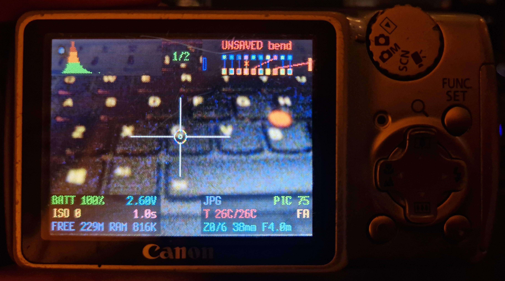

# CHDK Rewired

A fork of [CHDK](https://chdk.fandom.com/wiki/CHDK) that turns early Canon PowerShots into instruments for deliberate image corruption.

<p align="center">

  

</p>

The sensor's ADC output is rewired in software before Canon's imaging pipeline ever sees it. A bend is a **routing matrix**: for each output bit, name where its value comes from: another bit, its inverse, a constant, a clock, noise, the black level, a held sample. The result lands in the JPEG and the DNG alike, and can be patched live on the shooting screen with the camera's own buttons.

```
                    output bit
              9  8  7  6  5  4  3  2  1  0
            ┌──┬──┬──┬──┬──┬──┬──┬──┬──┬──┐
    source  │d0│d8│~d7│NZ│d5│LO│d3│d2│d1│d9│   swap 9↔0, invert 7,
            └──┴──┴──┴──┴──┴──┴──┴──┴──┴──┘    noise on 6, kill 4
```

Nothing here is written to the camera. It all runs in RAM off the memory card, so taking the card out gives you a stock camera back.

**→ [The manual](manual.pdf) is the documentation.** Everything below is how to build and install; the manual is how to use it.

## What it adds

On top of everything stock CHDK already does:

| | |
|---|---|
| **Bend matrix** | 10/12bpp routing matrix over the ADC data bus: twelve signal buses, five trash generators, applied to both the captured frame and the live view |
| **Bend mode** | a GUI mode alongside `<ALT>`: a patchbay strip and source knob driven from the shooting screen, so a bend is edited while you watch it |
| **Presets** | bends saved to and loaded from the card as numbered `BENDnn.BND` files, with a browser and constrained random generation |
| **Experimental profiles** | a second engine over the frame buffer the matrix writes into: stuck address lines, DMA stride errors, lost pixel clocks, foreign buffers on the data lanes. Composes with the matrix |
| **Segments** | up to sixteen regions of one frame, independently wired, from one shutter press |
| **Multiple exposure** | several frames developed into one, additive or averaged, with a live ghost of what is already there |
| **Persistent OSD** | a two-field, per-element-coloured status overlay that survives the half-press and mode changes |
| **Record UI** | size, quality and drive mode changed from the shooting screen without leaving it |
| **Sidecar tagging** | every photo gets a file recording exactly what it was bent with, so a frame you like can be reproduced |
| **Game Boy player** | a Game Boy / Game Boy Color emulator, including the Game Boy Camera cartridge wired to the live viewport |
| **Themes and grids** | five palettes that recolour everything this fork draws, plus custom reticles and framing grids |
| **Custom boot screens** | Canon's ROM startup image replaced, per body |

## Supported cameras

| Camera | Firmware | Bend matrix | Persistent OSD | Record UI | Custom sounds | Boot screen |
|---|---|:---:|:---:|:---:|:---:|:---:|
| PowerShot A410 ⚠️ | 100e | ✅ | ✅ | ✅ | ❌ | ❌ ¹ |
| PowerShot A430 | 100b | ✅ | ✅ | ✅ | ✅ | ✅ |
| PowerShot A460 | 100d | ✅ | ✅ | ✅ | ✅ | ✅ |
| PowerShot A470 | 102c | ✅ | ✅ | ✅ | ✅ | ✅ |
| PowerShot A480 | 100b | ✅ | ✅ | ✅ | ✅ | ✅ ² |
| PowerShot A540 | 100b | ✅ | ✅ | ✅ | ✅ | ❌ |
| PowerShot A640 | 100b | ✅ | ✅ | ✅ | ❌ | ❌ |

¹ This ROM carries no startup image to replace. ² With a boot animation.

> ⚠️ **The A410 is not stable.** It intermittently shuts down with an E16 error — on the shutter press, on taking a picture, or with a black live view on power-on. It is a shutdown, not damage: pull the card and the camera is stock again. The cause is a sensor FIFO overrun that seven separate attempted fixes failed to cure, and it may well be a tired sensor rather than this software. It ships anyway in case someone with an A410 in a drawer fancies a go — just don't rely on it.

Multiple exposure, segments, presets, sidecar tagging, the Game Boy player, themes and grids are available on every camera in the table.

**Firmware version is a hard gate.** Each build is compiled against one exact firmware revision, the one in the table and no other. On anything else CHDK will not load at all, and cameras of the same model shipped with different firmware. Step 1 below is how to check yours; do it before anything else.

## Installing

This section assumes you have never used a terminal. Follow it in order and you will not need to understand any of it.

You will need:

* **An SD card of 2 GB or smaller.** This is not a suggestion. Anything larger than 2 GB is an SDHC card, and these cameras cannot read SDHC at all, so the card will not work no matter what you put on it. Old 512 MB, 1 GB and 2 GB cards are cheap and plentiful.
* **A card reader**, or an SD slot in your computer.
* **Your camera**, and five minutes.

The card gets completely erased. Nothing is written to the camera itself, so if anything goes wrong you take the card out and you have an ordinary camera back. If the camera ever freezes, pull the battery out. No harm done.

### Step 1: check your camera's firmware version

Do this first. Each build here is compiled against **one exact firmware revision**, the one in the table above, and on any other version CHDK simply will not load. Cameras of the same model shipped with different firmware, so you cannot tell from the model name alone.

1. Put any SD card in the camera and switch it on in **PLAY** mode (the blue triangle, not the shooting mode).
2. Hold down **FUNC./SET** and, while holding it, press **DISP.**
3. A line of small text appears at the bottom of the screen. Among the product code and region letters it contains **Firmware Ver** followed by the version, `GM1.00B` for instance.

The part you want is the number after **Firmware Ver**. `GM1.00B` means firmware `100b`; `1.02C` means `102c`. Compare it with your camera's row:

| Camera | Screen shows | You need the package |
|---|---|---|
| A410 ⚠️ unstable | `1.00E` | `dist/A410` |
| A430 | `1.00B` | `dist/A430` |
| A460 | `1.00D` | `dist/A460` |
| A470 | `1.02C` | `dist/A470` |
| A480 | `1.00B` | `dist/A480` |
| A540 | `1.00B` | `dist/A540` |
| A640 | `1.00B` | `dist/A640` |

If your camera shows a different version from the one listed for it, stop here. None of these builds will run on it.

### Step 2: download the files

On the [repository page](https://github.com/lr-m/CHDK_Rewired), click the green **Code** button, then **Download ZIP**. Unzip it wherever you like; your Downloads folder is fine. You will get a folder called `CHDK_Rewired-main`.

Inside it, open `dist`, and then the folder for your camera, `A480` say. That folder holds everything the rest of these steps needs:

```
CHDK-A480-100b-card.zip     the card contents
flash-card-linux.sh         one of these three writes the card
flash-card-macos.sh
flash-card-windows.ps1
READ_ME_FIRST.txt           a short version of these instructions
vers.req                    used by the firmware check in step 1
SHA256SUMS.txt              checksums, ignore unless you want them
```

### Step 3: identify the card, and be certain

> [!CAUTION]
> **This step erases an entire disk, permanently, with no undo and no recycle bin.** You are about to tell a program which disk to wipe. If you name the wrong one, whether that is your hard drive, your backup drive or the external disk with your photos on it, everything on it is gone. There is no confirmation dialogue from your operating system, no "are you sure" from Windows, and no way to get it back afterwards.
>
> The disk names involved (`/dev/sde`, `disk4`, `2`) are short, similar-looking, and **they change between sessions**. The card that was `/dev/sdd` yesterday can be `/dev/sde` today, and the number that was your card last week can be your hard drive this week. Never reuse a name you remember. Work it out fresh, every single time, using the checks below.

The scripts do have guards. They refuse the disk your operating system boots from, they refuse disks the system does not report as removable (on Windows, which is vaguer about this, an unexpected bus type makes you type it out in full before continuing), and they refuse anything too large to hold a FAT16 volume, which in practice means anything much over 2 GB. Those guards catch most mistakes. They cannot catch all of them: a 2 GB USB stick with your only copy of something on it would pass every single one. So do the checks below yourself.

**The reliable method is to watch the card disappear.** Do not try to pick the card out of a list by eye, because names and sizes are easy to misread. Instead: with the card plugged in, list the disks; unplug it; list them again; and see which entry vanished. That one is the card and nothing else can be. Then confirm it a second way before you commit to it.

Put the SD card in your reader, then follow the section for your system.

<details open>
<summary><b>Linux</b></summary>

Open a terminal in the camera's folder. In most file managers, right-click inside the folder and choose **Open in Terminal**.

**Check 1, watch it disappear.** With the card plugged in, run:

```console
$ lsblk -o NAME,SIZE,RM,TYPE,MOUNTPOINT
NAME     SIZE RM TYPE MOUNTPOINT
sda    238.5G  0 disk
├─sda1     1G  0 part /boot/efi
└─sda2 237.5G  0 part /
sde      1.9G  1 disk
└─sde1   1.9G  1 part /media/you/UNTITLED
```

Now **physically unplug the card reader** and run exactly the same command again:

```console
$ lsblk -o NAME,SIZE,RM,TYPE,MOUNTPOINT
NAME     SIZE RM TYPE MOUNTPOINT
sda    238.5G  0 disk
├─sda1     1G  0 part /boot/efi
└─sda2 237.5G  0 part /
```

The entry that disappeared is your card, `sde` here. Plug it back in, run it once more, and confirm the same entry comes back. **That name, and only that name, is safe to give the script.**

**Check 2, confirm what it is.** Run this with your own name in place of `sde`:

```console
$ lsblk -o NAME,SIZE,RM,HOTPLUG,TRAN,VENDOR,MODEL /dev/sde
NAME  SIZE RM HOTPLUG TRAN VENDOR   MODEL
sde   1.9G  1       1 usb  Generic  SD/MMC Card Reader
└─sde1 1.9G 1       1
```

Before you go any further, all four of these must be true:

* `RM` is **1** and `HOTPLUG` is **1**, so the system agrees it is removable.
* `TRAN` is **usb**, or `mmc` for a built-in slot. Not `sata` or `nvme`, which are internal drives.
* The size matches the card you are holding, 1.9G for a 2 GB card. If it says 238.5G or 1.8T, **stop**: that is a hard drive.
* The `MODEL` reads like a card reader, not like a disk. `Samsung SSD`, `WD Elements` or `Seagate Backup` mean **stop**.

**Check 3, make sure it is not mounted anywhere important.** Run:

```console
$ lsblk -o NAME,MOUNTPOINT /dev/sde
NAME   MOUNTPOINT
sde
└─sde1 /media/you/UNTITLED
```

If anything under your device is mounted at `/`, `/home`, `/boot` or `/boot/efi`, **stop immediately**. You have the wrong device, and you are looking at the disk your computer runs from.

**Use the whole disk (`/dev/sde`), not the partition (`/dev/sde1`).** The partition has a number on the end; the disk does not.

Now run the script, putting your own device in place of `/dev/sde`:

```console
$ sudo ./flash-card-linux.sh /dev/sde
```

It asks for your password (typing shows nothing, which is normal), then:

```console
==> unpacking CHDK-A480-100b-card.zip
About to ERASE /dev/sde (2GB, model: SD/MMC Card Reader)
NAME  SIZE FSTYPE LABEL MOUNTPOINT
sde   1.9G
└─sde1 1.9G vfat  UNTITLED /media/you/UNTITLED

Type ERASE to continue:
```

Type `ERASE` in capitals and press Enter. The rest runs by itself:

```console
==> writing partition table
==> formatting /dev/sde1 as FAT16 (16KiB clusters, 61055 clusters)
==> volume label: RWD_A480
==> writing BOOTDISK signature at 0x40
==> copying CHDK

Card contents:
A480.TXT
CHDK
DISKBOOT.BIN
PS.FIR
camnotes.txt
changelog.txt
readme.txt
vers.req

OK - card is bootable (signature verified).

Now slide the card's physical LOCK switch to locked before putting it in
the camera. The camera only looks for DISKBOOT.BIN on a locked card; it can
still write photos, because the firmware ignores the switch once running.
```

If it says `unzip not installed`, run `sudo apt install unzip` (or `sudo pacman -S unzip`) and try again.

</details>

<details open>
<summary><b>macOS</b></summary>

Open Terminal (press ⌘-Space, type `Terminal`, press Enter), then type `cd ` (with a space after it), drag the camera's folder from Finder onto the Terminal window, and press Enter. That moves the terminal into that folder.

**Check 1, watch it disappear.** With the card plugged in, run:

```console
$ diskutil list
/dev/disk0 (internal, physical):
   #:                       TYPE NAME                    SIZE       IDENTIFIER
   0:      GUID_partition_scheme                        *500.3 GB   disk0
   1:                        EFI EFI                     314.6 MB   disk0s1
   2:                 Apple_APFS Container disk1         499.9 GB   disk0s2

/dev/disk4 (external, physical):
   #:                       TYPE NAME                    SIZE       IDENTIFIER
   0:     FDisk_partition_scheme                        *2.0 GB     disk4
   1:                 DOS_FAT_32 UNTITLED                2.0 GB     disk4s1
```

Now **physically unplug the card reader** and run `diskutil list` again. The whole `/dev/disk4` block disappears. Plug it back in, run it a third time, and confirm it comes back. **That identifier, and only that one, is safe to give the script.**

**Check 2, confirm what it is.** Run this with your own identifier in place of `disk4`:

```console
$ diskutil info disk4
```

That prints a long list. Find these lines and check every one:

```
   Device Identifier:        disk4
   Device / Media Name:      SD Card Reader
   Removable Media:          Removable
   Device Location:          External
   Protocol:                 USB
   Internal:                 No
   Disk Size:                2.0 GB (2000000000 Bytes)
   Virtual:                  No
```

* `Removable Media` must say **Removable**.
* `Device Location` must say **External** and `Internal` must say **No**. If it says `Internal: Yes`, **stop**. That is a disk inside your Mac.
* `Disk Size` must match the card you are holding. `500.3 GB` or `1.0 TB` means **stop**.
* `Protocol` should be `USB` or `Secure Digital`. `PCI-Express` or `Apple Fabric` means an internal drive, so **stop**.

**Use the whole disk (`disk4`), not a slice (`disk4s1`).** A slice has an `s` and a number on the end; the whole disk does not.

Then:

```console
$ sudo ./flash-card-macos.sh disk4
```

It asks for your password (typing shows nothing, which is normal), then:

```console
==> unpacking CHDK-A480-100b-card.zip
About to ERASE disk4  (2GB, SD Card Reader)

  source:       /var/folders/.../tmp.XXXX
  volume label: RWD_A480
  cluster size: 16KiB

Type ERASE to continue:
```

Type `ERASE` in capitals and press Enter:

```console
==> unmounting
==> writing MBR partition table
==> reformatting FAT16 with 16KiB clusters
==> setting partition type 0x06, active
==> writing BOOTDISK signature at 0x40
==> mounting and copying CHDK

Card contents:
A480.TXT	CHDK		DISKBOOT.BIN	PS.FIR
camnotes.txt	changelog.txt	readme.txt	vers.req

OK - card is bootable (BOOTDISK signature verified) and safe to remove.
```

If macOS refuses to run the script, run `chmod +x flash-card-macos.sh` first.

</details>

<details open>
<summary><b>Windows</b></summary>

You need an **Administrator** PowerShell. Click Start, type `PowerShell`, right-click **Windows PowerShell** in the results and choose **Run as administrator**. Click **Yes** on the prompt.

Move into the camera's folder. Type `cd `, with a space after it, then copy the folder's path from File Explorer's address bar and paste it (right-click pastes in PowerShell):

```console
PS C:\Windows\system32> cd "C:\Users\You\Downloads\CHDK_Rewired-main\dist\A480"
```

**Check 1, watch it disappear.** With the card plugged in, run:

```console
PS> Get-Disk

Number Friendly Name          Serial Number  HealthStatus  OperationalStatus  Total Size  Partition Style
------ -------------          -------------  ------------  -----------------  ----------  ---------------
0      Samsung SSD 860        S3Z2NB0K       Healthy       Online                238.5 GB  GPT
2      Generic STORAGE DEVICE 000000000272   Healthy       Online                  1.9 GB  MBR
```

Now **physically unplug the card reader** and run `Get-Disk` again. The row that disappears is your card, **Number 2** here. Plug it back in, run it a third time, and confirm the same number comes back. **That number, and only that number, is safe to give the script.**

**Check 2, confirm what it is.** Run this with your own number in place of `2`:

```console
PS> Get-Disk 2 | Format-List Number, FriendlyName, BusType, Size, IsBoot, IsSystem, IsOffline

Number       : 2
FriendlyName : Generic STORAGE DEVICE
BusType      : USB
Size         : 2003828736
IsBoot       : False
IsSystem     : False
IsOffline    : False
```

* `BusType` must be **USB** (or `SD`). If it says `SATA`, `NVMe` or `RAID`, **stop**. That is an internal drive.
* `IsBoot` and `IsSystem` must both be **False**. If either is `True`, **stop immediately**: that disk is what Windows itself runs from.
* `Size` must match the card. It is shown in bytes, so a 2 GB card is around `2000000000`. A number starting `238` or `1000` followed by many more digits is a hard drive, so **stop**.

**Check 3, cross-check the drive letter.** Open File Explorer and note the letter the card appears under, then run:

```console
PS> Get-Partition -DiskNumber 2 | Select-Object DiskNumber, DriveLetter, Size

DiskNumber DriveLetter        Size
---------- -----------        ----
         2           E  2001731584
```

The letter here must be the same one File Explorer shows for the card. If it comes back `C`, **stop immediately**. That is your Windows drive.

Then:

```console
PS> .\flash-card-windows.ps1 -DiskNumber 2
```

If PowerShell refuses with a message about execution policy, run this once and try again:

```console
PS> Set-ExecutionPolicy -Scope Process -ExecutionPolicy Bypass
```

The script prints:

```console
==> unpacking CHDK-A480-100b-card.zip

About to ERASE disk 2 : Generic STORAGE DEVICE, 1.9 GB, bus USB

  source:       C:\Users\You\AppData\Local\Temp\...
  volume label: RWD_A480
  cluster size: 16 KiB

Type ERASE to continue:
```

Type `ERASE` in capitals and press Enter:

```console
==> clearing disk
==> creating FAT16 partition
==> formatting FAT16 (16 KiB clusters), label RWD_A480
==> writing BOOTDISK signature at 0x40
==> copying CHDK

Card contents:
A480.TXT  CHDK  DISKBOOT.BIN  PS.FIR  camnotes.txt  changelog.txt  readme.txt  vers.req

OK - card is bootable (BOOTDISK signature verified).

Eject the card with Safely Remove Hardware, then slide its physical LOCK
switch to locked before putting it in the camera.
```

If the disk's bus type is not USB, the script asks you to type the bus type out in full before it will continue. That is a deliberate extra hurdle, because a non-USB disk is much more likely to be something you did not mean to erase.

</details>

### Step 4: lock the card and switch on

**Slide the card's physical LOCK switch to the locked position.** This is the small plastic tab on the left edge of the card, and it feels wrong, because you are write-protecting the card you just wrote to. Do it anyway: these cameras only look for CHDK on a locked card. Photos still save normally, because the firmware ignores the switch once it is running.

Put the card in the camera and switch on. CHDK loads by itself; you will see its splash screen for a moment. Press **PRINT/SHARE** (the button with the printer icon) and `<ALT>` appears at the bottom of the screen. That is CHDK running. Press it again to go back to normal shooting.

From there, [the manual](manual.pdf) takes over.

### If something goes wrong

**The camera switches on as normal, no CHDK.** Nearly always one of three things: the card's LOCK switch is not locked, the card is bigger than 2 GB, or the firmware version does not match. Check them in that order.

**The camera will not switch on at all.** Take the card out. The camera will be fine, since it is stock and nothing was written to it. This means the card was formatted in a way this body's boot ROM rejects; try a smaller card.

**The camera freezes.** Pull the battery out. No harm is done, and nothing persists: put the card in without the LOCK switch on and the camera ignores CHDK entirely.

**You would rather not erase a whole card.** Unzip `CHDK-<MODEL>-<fw>-card.zip` onto a card the camera itself formatted, then in PLAY mode go **MENU** and scroll to the bottom to **Firm Update…**. Same result, but it has to be done again after every power-off, and it does not need the LOCK switch.

**Never label a CHDK card `CHDK`.** If you ever format one of these cards yourself, give it any name but that one. On FAT the volume label is stored as an entry in the root directory, so a card labelled `CHDK` ends up with two entries spelled `CHDK`, the label and the actual `CHDK` folder. The camera finds the label first, concludes the folder is not a folder, and stops: modules stop loading and settings stop saving, while the card looks perfect on a computer. The scripts here label cards `RWD_<model>` and refuse `CHDK` outright.

**No Game Boy ROMs are included.** `CHDK/GBC/` on the card ships empty with a note in it. Put your own `.gb` / `.gbc` files there and they appear in the player's list under Miscellaneous Stuff → Games → Game Boy.

## Building

Linux. You need `arm-none-eabi-gcc`, a host C compiler, `make` and `zip`:

```sh
sudo apt install gcc-arm-none-eabi make build-essential zip     # Debian/Ubuntu
sudo pacman -S arm-none-eabi-gcc make base-devel zip            # Arch
```

Then, from the root of this repository:

```sh
./build-all.sh                 # every supported camera and firmware
./build-all.sh a480 a470       # just these models
./build-all.sh -n              # dry run - print what would happen
./build-all.sh --no-dist       # build only, leave dist/ alone
```

Each target is built, copied to `cameras/<model>/builds/`, and used to refresh `cameras/<model>/card/` and that camera's package in `dist/`. `dist/` is output only, so delete the whole thing and it comes back.

To build one target by hand:

```sh
cd chdk-src
cp localbuildconf.inc.example localbuildconf.inc     # once
make PLATFORM=a480 PLATFORMSUB=100b fir
```

Output lands in `chdk-src/bin/` as `DISKBOOT.BIN` plus `CHDK/MODULES/*.flt`.

`localbuildconf.inc.example` waves through upstream's compiler whitelist, which does not include GCC 13 as shipped by current distributions. GCC 13 builds these targets cleanly; if a build ever misbehaves on the camera, install ARM's 11.3 toolchain and drop that override before blaming anything else.

Three things about this build system cost real time if you do not know them:

* **`make clean` is per-platform.** It does not clean another platform's tree.
* **There is no header dependency tracking.** Editing a `platform_camera.h` does not trigger a rebuild, so run `make PLATFORM=x PLATFORMSUB=y clean` first, or get a binary silently missing the feature you just turned on.
* **Modules resolve core symbols through an export table.** Any build that moves the core's size invalidates the `.flt` files already on a card; replace them alongside `DISKBOOT.BIN`. `build-all.sh` does this for you.

Builds are not byte-reproducible, because `__DATE__`/`__TIME__` are compiled in, so checksums change on every run even with no source change.

`scripts/build-macos.sh` and `scripts/build-windows-msys2.sh` set up and build this tree on those hosts.

To repackage `dist/` without rebuilding, after hand-editing a card tree:

```sh
./packaging/make_dist.sh              # every camera
./packaging/make_dist.sh a480         # just this one
```

## The manual

[`manual.pdf`](manual.pdf) is the whole thing: the bend matrix, saving and recalling bends, experimental profiles, segments, multiple exposure, the Game Boy player, and a chapter of field notes on getting deliberate accidents instead of only accidents. It is illustrated throughout with frames shot on these cameras.

**Mignova**, the display face on its cover and chapter titles, is licensed for non-commercial use, so buy the creator's commercial licence before selling or commercially distributing the manual. The text faces (Orbitron, Michroma, Space Grotesk, Space Mono) are all under the SIL Open Font Licence 1.1.

## Layout

```
build-all.sh        build every camera, refresh the card trees, repackage dist/
chdk-src/           the CHDK source tree
cameras/<model>/
    card/           the card tree for that body - what actually gets flashed
    builds/         built DISKBOOT.BIN / PS.FIR, one per firmware
packaging/          make_dist.sh, and the flashing scripts it stamps per camera
scripts/            building this tree on macOS and on Windows under MSYS2
manual.pdf          the manual
dist/               generated release packages, one per camera
```

## Firmware

**No Canon firmware is distributed here.** ROM dumps and `.FIR` update files are Canon's copyrighted code and are not in this repository.

## Licence

GPL, as upstream; see [`COPYING`](COPYING). Upstream CHDK is the work of the CHDK community; this fork adds to it and takes none of the credit for it.
